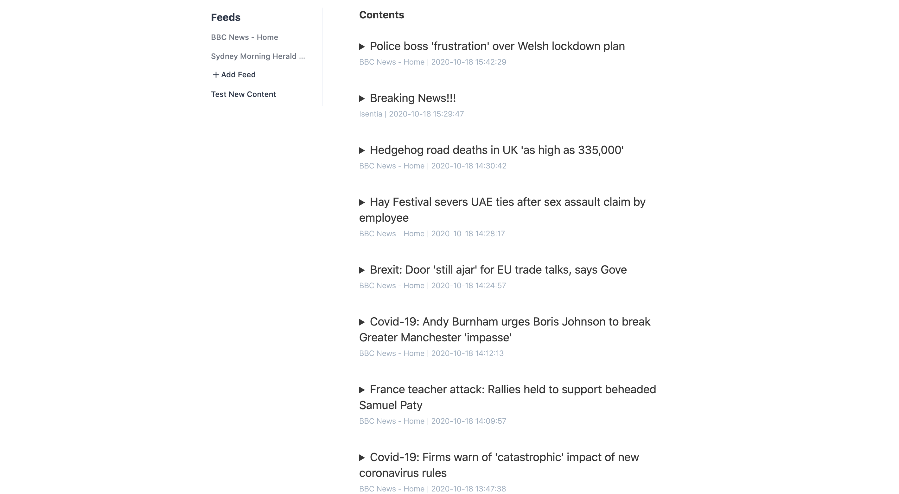
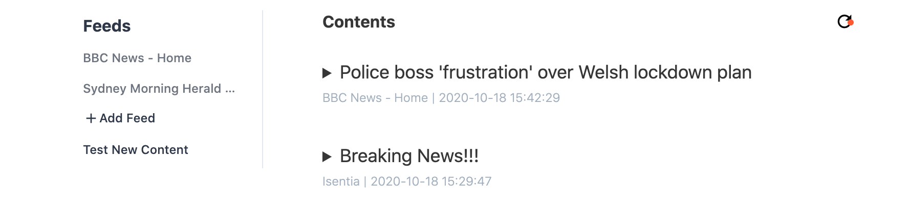
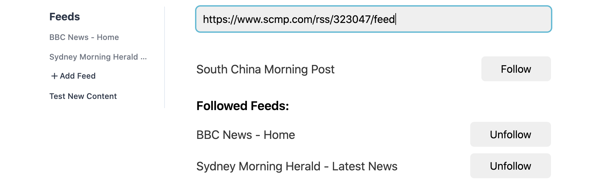

# Isentia

A RSS reader.

[Demo hosted on Netlify](https://isentia.netlify.app/)

## Development

- Clone to local: `git clone https://github.com/4wangyu/isentia.git`
- Install deps: `npm i`
- Run `ng serve` for a dev server. Navigate to `http://localhost:4200/`.

## Running unit tests

Tests are written in Jasmine.

Run `npm test` or `ng test` to execute the unit tests.

## Build

Run `ng build` to build the project. The build artifacts will be stored in the dist/directory. Use the `--prod` flag for a production build.

## Usage

#### New Feed Contents

When there is new feed contents coming in, a refresh button with red dot will be shown at the top right corner of the app.

Click the button to show the new contents.

#### Add Feed

On clicking the **+ Add Feed** button, an input box will be shown. Press **Enter** after inputting the new feed's URL. The feed's title and a Follow button will be shown. Click the button to add the feed to your subscription list.

The followed feeds are also shown here. You can click the Unfollow button to unsubscribe a feed.

Clicking on the **Feeds** button at the top left corner to go back to the main contents view.

#### Test New Feed Content

Since it's not frequent to have new feed contents coming in, a **Test New Content** button is added to simulate the effect. When clicking on this button, one Feed Item will be added. To show the newly added item, click on the refresh button with red dot at the top right corner.

## Details

- [BBC](http://feeds.bbci.co.uk/news/rss.xml) & [SMH](https://www.smh.com.au/rss/feed.xml) are the default RSS feeds.
- The app saves all the subscribed feeds in LocalStorage.
- The app polls for new feed contents every 10 mins.
- An [autofocus directive](https://github.com/4wangyu/isentia/blob/master/src/app/directives/autofocus.directive.ts) is used for autofocusing the Feed URL input.
- [forwardRef](https://github.com/4wangyu/isentia/blob/master/src/app/components/feeds/feeds.component.ts) is used to access parent component from child component.

## Credits

- This app uses [rss2json](https://rss2json.com/)'s service to convert RSS feed to standardized JSON format with an api_key. The request limit is 10,000 Requests per day(every 24 hrs).

- [Angular v10](https://github.com/angular)
- [ngrx v10](https://github.com/ngrx)
- [Water.css](https://github.com/kognise/water.css)
